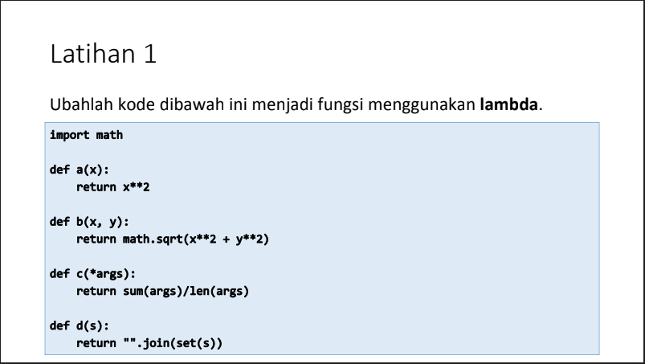
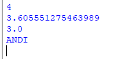
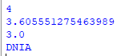

# Iman Setiawan
# TI.21.A1

**Tugas Latihan - Pertemuan 11**

Berikut soal tugas dari modul Lab 6.\

Berikut adalah code dari soal menggunakan def.\
~~~

import math

def a(x):
    return x**2

def b(x,y):
    return math.sqrt(x**2+y**2)

def c(*args):
    return sum(args)/len(args)

def d(s):
    return "".join(set(s))

print(a(2))
print(b(2,3))
print(c(2,3,4))
print(d("DINA"))

~~~

Dan ini hasil dari program tersebut.\

Dibawah ini adalah code diatas di ubah menggunakan lambda.\
~~~

import math

a = lambda x: x**2

b = lambda x,y: math.sqrt(x**2+y**2)

c = lambda *args: sum(args)/len(args)

d = lambda s: "".join(set(s))

print(a(2))
print(b(2,3))
print(c(2,3,4))
print(d("DINA"))

~~~

Dan ini adalah code setelah menggunakan lambda dan hasil nya sama.\

